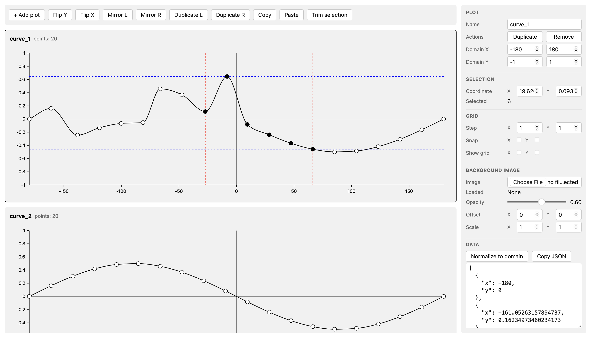

# Aero Curves

Aero Curves is a lightweight curve editor for games and simulations. Build, tweak, and visualize control-point curves with a fast, keyboard-friendly UI.

## Trace with a background image

Use a background image to trace existing plots or scanned charts. Open the Background panel, load an image, then adjust position, scale, and opacity until the plot aligns. Lock it in place and trace your curve points on top for quick digitization.
